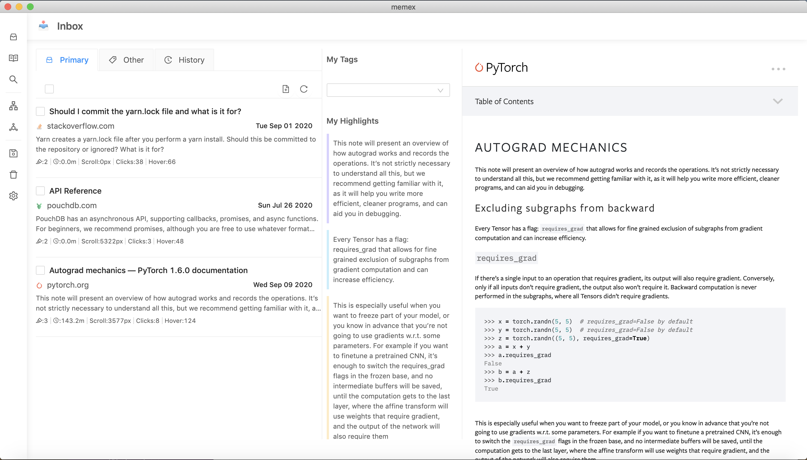

## Demo

Here is a demo on how the Chrome Extension works:

https://vimeo.com/456346417

## Motivation

Read the full blog article here: https://www.steveliu.co/memex


## Install


First, clone the repo via git and install dependencies:

```bash
git clone https://github.com/steve-1820/memex.git
cd memex
yarn
```

## Starting Development

Start the app in the `dev` environment. This starts the renderer process in [**hot-module-replacement**](https://webpack.js.org/guides/hmr-react/) mode and starts a webpack dev server that sends hot updates to the renderer process:

```bash
yarn dev
```

## Packaging for Production

To package apps for the local platform:

```bash
yarn package
```

## License

MIT Licence
